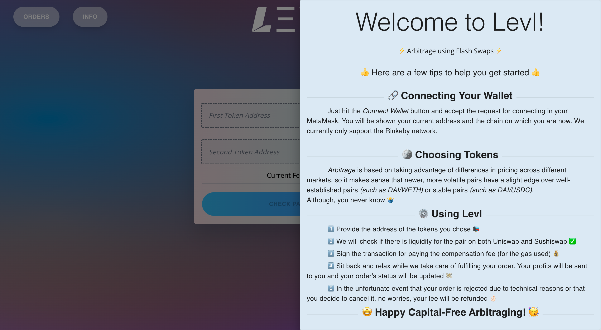
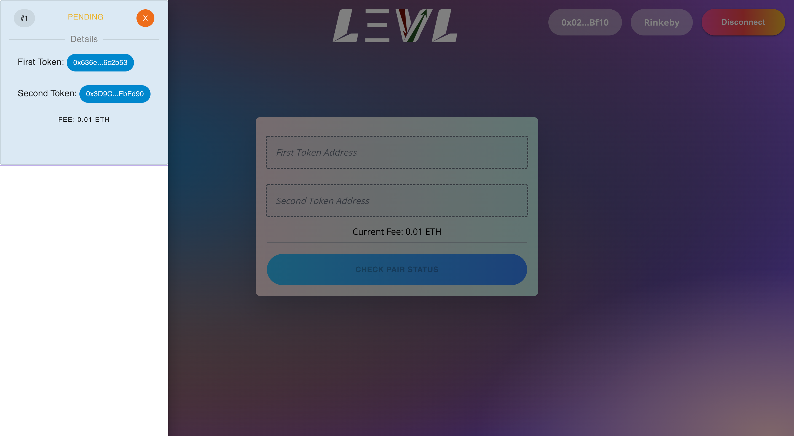
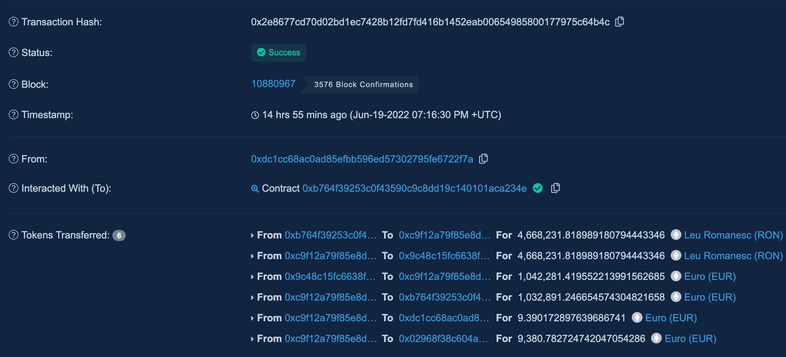

# Ethereum-Arbitrage-Web-Platform

## Contents

1. [Description](#Description)
2. [Sample Flow](#Sample-Flow)
3. [Other Features](#Other-Features)
4. [Installation Guide](#Installation-Guide)
5. [Working Example](#Working-Example)
6. [Further Improvements](#Further-Improvements)
7. [License](#License)

## Description

`Levl - Flash Arbitrage` is a platform that allows users to take advantage of arbitrage opportunities that may arise between Uniswap and Sushiswap.

The _catch_ is that the operation doesn't involve the user's time or capital. The platform is constantly monitoring the user's chosen pairs and executes transaction by first Flash Loaning from one of the DEXes.

## Sample Flow

### Landing Page

When the user connects to the platform this is the very first thing they see.


### Connecting Your Wallet

To connect your MetaMask wallet, click on the `Connect Wallet` button in the top-right.


A preview of your address and the network over which you are connected (in this example, _Rinkeby_) will be shown. To disconnect, simply press the `Disconnect` button.

### Showing the Guide

In order to show the short informational banner, click on the `INFO` button in the top-left.



### Placing an Order

An order represents the user's wish to track the existence of any arbitrage opportunities for the selected pair.

#### **Requirements**

- An order requires two valid token addresses.

_If not, the field will be marked red, as shown below:_


- The two tokens should exist as a pair on both Uniswap and Sushiswap.
- At the moment, it is also required that each of the tokens is paired with `DAI` (in order to determine an objective valuation of the two tokens)

Fortunately, the platform does all of these checks, so no worries here.

#### **Placing the Order**

Simply enter the addresses of your tokens in the two input fields and hit the `CHECK PAIR STATUS` button.

If there are errors, there will be a red alert displayed in the bottom-left, explaining the reason behind the failure, like shown:


If everything is alright, though, there will be a green alert displayed in the bottom-left. Afterwards, click the `PLACE ORDER` button.


## Confirming the Order

You will be asked to confirm the transaction for the order creation and pay a _fee_. The fee is used to cover for the gas expenses involved and nothing more.


Again, a green alert will be shown in the bottom-left if everything goes smoothly.


### Sample Order Placement Transaction

Your transaction should look something like this.


### Showing Orders

If you have at least _one_ `CONFIRMED` Order Placement transaction on etherscan, refresh the page and click on the `ORDERS` button in the top-left.



### Order Status

An order can have one of the following statuses:

- PENDING - the order has been picked up, but there has yet to be an opportunity for executing it
- CONFIRMED - the order has been executed and the proceeds have been sent to the user's wallet

  _In this particular case, the transaction receipt is also available and clicking the button will redirect to etherscan._

- REJECTED - if there are problems that interfere with the execution (e.g. lack of liquidity), the order will be rejected and the order will not be tracked anymore

  _If this is the case, you should cancel the order._

- DELETED - the order has been cancelled by the user
  _In case of cancelling an order, the fee for covering the gas costs is returned to the user's wallet._

### Cancelling an Order

To cancel an order, simply click on the `x` button placed in the top-right of the order card.

### Successful Execution

In case of a successful execution, you will find the funds in your wallet. There is no _withdraw_ transaction required on the user's part.


A successfully executed Flash Arbitrage transaction will look something like this:



## Other Features

On the configuring side, for the more _savvy_ users, one can modify multiple things, including, but not limited to:

- The Gas Coverage Fee of the Platform
- The Commission Charged on Successful Execution
- Various Execution or Profitability Thresholds

## Installation Guide

The guide is written using macOS Monterey 12.4 as the distribution of reference. However, the steps undertaken should be similar on any other distribution.

The first step is cloning the repo. Once that's finished, proceed as described below.

### Python

You should have `Python` (3.9 or later) installed, as well as the `pip` package manager.

To download Python, follow [this link](https://www.python.org/downloads/).

To install pip, run the following commands, one by one, in the terminal:

```bash
curl https://bootstrap.pypa.io/get-pip.py -o get-pip.py
python3 get-pip.py
rm get-pip.py
```

To check your version of Python, run:

```bash
python3 --version
```

To check your version of pip, run:

```bash
pip --version
```

<!-- ### Solidity

The Smart Contracts are written in `Solidity`, thus it makes sense for a compiler to be needed.

To install the `solc` compiler, run:

Insert command here -->

### Brownie

The framework used for the development and deployment of the Solidity Smart Contracts is `Brownie`. It is installed using the `pipx` package manager, so we need to install that one first:

```bash
python3 -m pip install --user pipx
python3 -m pipx ensurepath
```

Afterwards, restart your terminal, and type the following command:

```bash
pipx install eth-brownie
```

To verify that the installation was indeed successful, type `brownie` in the terminal. Your output should look something like this:

```console
Brownie v1.18.2 - Python development framework for Ethereum

Usage:  brownie <command> [<args>...] [options <args>]

...
etc.
```

### React

If you made it this far, everything should work just fine. All of the useful functions are exposed and ready to use as of now.

However, for a better experience, you could use the front-end! It is written in `React.js`, so we need to install a few things.

For starters, we need to install `Node.js` (16 or later) and `NPM` (8 or later).

To download Node.js, follow [this link](https://nodejs.org/en/). Once the installation process is done, check your versions of Node.js and NPM by running the following:

```bash
node --version
npm --version
```

If everything went smoothly, open a new terminal window, go to the client folder, and take care of all the dependencies by running:

```bash
npm i
```

To start the app, simply run:

```bash
npm run dev
```

Don't panic if there are errors on the screen, it's because the builds are not migrated yet. We will take care of that immediately. For now, if you can see something like the following in the console, it's all that matters.

```console
> levl@0.0.0 dev
> vite

vite v2.9.14 dev server running at:

> Local: http://localhost:3000/
> Network: use `--host` to expose
```

### .env

Sensitive information should **NOT** be stored online, thus, you should create this file by yourself. Its responsibility is to hold the private key and your Infura Node access token.

```bash
touch .env
```

The format is:

```bash
export PRIVATE_KEY=<private key goes here>
export WEB3_INFURA_PROJECT_ID=<infura project ID goes here>
export ETHERSCAN_TOKEN=<etherscan access token goes here>
export DEPLOYER_KEY=<private key of the example token deployer wallet>
```

### First Run

There are two main components of the app, namely:

- The Contracts
- The Monitor

To compile the contracts, go to the main directory (_ethereum-arbitrage-web-platform_) and simply run:

```bash
brownie compile
```

To deploy them on a certain network, in this example, `Rinkeby`, run the following command containing the `--network` flag:

```bash
brownie run scripts/deploy_manager.py --network rinkeby
```

To start the monitor, run the following command in a separate terminal window:

```bash
brownie run scripts/arbitrage_manager.py --network rinkeby
```

_Note: Modify the sleep time in accordance to your preferences. It should be zero, but this could quickly lead to overloading the Infura / Alchemy node used for connecting and thus, may cause you to reach your daily request limit._

To spin up the front-end and use it for interacting with the platform, migrate the config and builds by running:

```bash
brownie run scripts/migration_manager.py --network rinkeby
```

And then, in a separate terminal window:

```bash
npm run dev
```

Now you are ready to take part in arbitraging. Just follow the steps provided in the [Sample Flow](#Sample-Flow) section and you are good to go!

## Working Example

There are two tokens provided as a working example in the `ERC20RON.sol` and `ERC20EUR.sol` files.

By running the `demo_manager.py` script, you will get a sure-fire arbitrage opportunity.

```bash
brownie run scripts/demo_manager.py --network rinkeby
```

Under the hood, what happens is, in order:

1. Liquidity Deployment
   - The two token contracts are deployed
   - Liquidity is provided asymmetrically on Uniswap and Sushiswap for the two tokens
   - DAI pairs are provided on Uniswap for both tokens as an objective value reference
2. Contract Deployment
   - The Order Manager Contract is deployed
   - The Flash Arbitrage Contract is deployed
   - The Data Provider Contract is deployed
3. Front-End Migration
   - The Config data is migrated to the front-end
   - The Contract ABIs are migrated to the front-end

Now, everything that's left for you to do is input the two token addresses in the fields, place the order and make sure the monitor is running.

You can find all relevant contract addresses in the `map.json` file.

## Further Improvements

This project would be best described as a Proof-of-Concept and it is by no means production-ready. Some improvements that could be made in this direction would include:

- Using Meta-Transactions instead of the `Gas Coverage Fee`
- For mass usage, the platform should be hosted and connected to a self-managed node, not through a third party
- Instead of comparing prices with **ETH** through **USD**, `WETH` pairs could be used.
- The only stablecoin used for price reference is `DAI`, the list could be extended to include others (_e.g. `USDC`, `USDT`_)
- Adding more DEXes to the monitor (_e.g. Pancakeswap, Balancer, Curve_)
- Using L2s or going cross-chain

## License

[MIT License](LICENSE)
